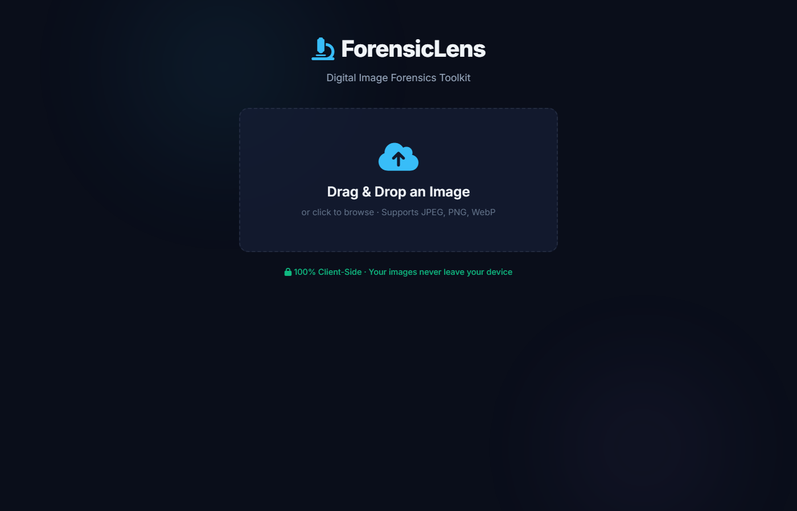

# 🔬 ForensicLens

> **Digital Image Forensics & Privacy Guard — 100% Client-Side**

ForensicLens v2 is a powerful, browser-based digital image forensics toolkit. It allows users to detect subtle manipulations (like splicing and cloning) using standard Digital Image Processing (DIP) algorithms. It also includes a **Privacy Guard** module to extract hidden EXIF metadata (including GPS telemetry) and securely scrub images before online sharing.



## ✨ Key Features

ForensicLens implements 6 core forensic modules running entirely in the browser via HTML5 Canvas.

### 1. Error Level Analysis (ELA)
Identifies areas within a JPEG image that have different compression levels, highlighting tampered regions.

### 2. Noise Pattern Analysis
Extracts the noise residual by subtracting a Gaussian-blurred version of the image. Inconsistent noise across regions suggests the image was spliced.

### 3. Copy-Move Forgery Detection
Detects duplicated (cloned) regions within the same image using block-based feature matching and lexicographic sorting.

### 4. Color Channel Analysis
Splits the image into individual R, G, B, Luminance, Hue, or Saturation channels to reveal artificial color alterations.

### 5. Edge & Gradient Detection
Applies convolution-based edge operators (Sobel, Laplacian, Prewitt, Roberts, Scharr) to reveal boundaries and editing artifacts.

### 6. Privacy Guard (Metadata & GPS)
Extracts hidden EXIF metadata (camera, GPS, timestamps) and visualizes location data on a live map using **Leaflet.js**. Includes a one-click scrubber to safely strip all metadata before sharing.

---

## 🛠️ Tech Stack

ForensicLens is built to be completely serverless. **Your images never leave your device.**
* **HTML5 / CSS3** (Custom Glassmorphism UI)
* **Vanilla JavaScript (ES6)**
* **HTML5 Canvas API / ImageData** (For all pixel-level processing)
* **Leaflet.js** (For GPS mapping with CartoDB Dark Matter tiles)

## 🚀 How to Run

Because the app is 100% client-side, you don't need to install any backend server or dependencies.

1. **Clone the repository:**
   ```bash
   git clone https://github.com/yourusername/image-forensics-toolkit-v2.git
   ```
2. **Open the project:**
   Simply open `index.html` in any modern web browser (Chrome, Firefox, Edge, Safari).
3. **Analyze an image:**
   Drag and drop any JPEG/PNG file onto the upload screen to begin forensic analysis. (You can use the images provided in the `test-images/` directory).

## 🛡️ Privacy & Security

This tool operates completely locally within your browser. There are no API calls, no databases, and no cloud uploads. When you use the "Scrub My Photo" feature, the image is re-rasterized on a hidden canvas locally, ensuring 100% metadata destruction without risking interception.

## 📄 License

This project is licensed under the MIT License - see the [LICENSE](LICENSE) file for details.
